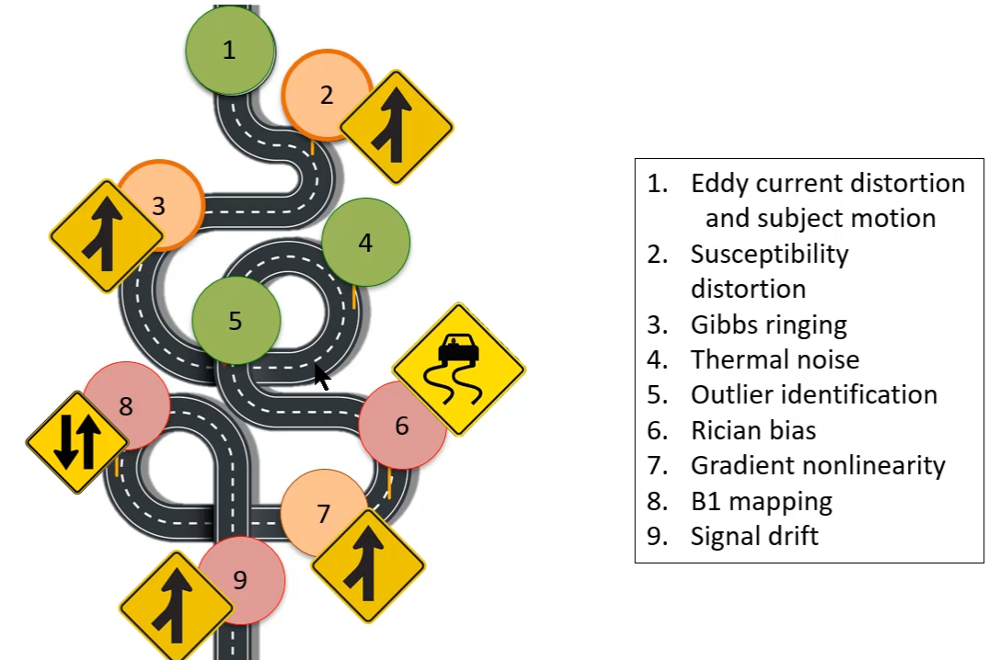
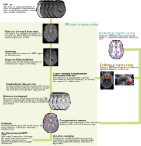

About dMRIPRep
==============

In his 2019 ISMRM talk on the state of consensus in diffusion MRI preprocessing, Jelle Veraart polled the polled the developers of some major software packages.


[Image Processing: Possible Guidelines for the Standardization & Clinical Applications](https://www.ismrm.org/19/program_files/MIS15.htm)

This led us to create a roadmap for *dMRIPrep*'s development


*dMRIPrep* is part of the NiPreps organization
- robust
- easy to use
- reproducible
- "glass box" architecture
- regular maintenance and upgrading of methods


Project Structure
-----------------

```
dmriprep
├── CHANGES.rst
├── Dockerfile
├── LICENSE
├── MANIFEST.in
├── Makefile
├── README.rst
├── dmriprep
│   ├── __about__.py
│   ├── __init__.py
│   ├── _version.py
│   ├── cli/
│   ├── config
│   │   ├── __init__.py
│   │   ├── reports-spec.yml
│   │   └── testing.py
│   ├── conftest.py
│   ├── data/
│   ├── interfaces
│   │   ├── __init__.py
│   │   ├── images.py
│   │   ├── reports.py
│   │   └── vectors.py
│   ├── utils
│   │   ├── __init__.py
│   │   ├── bids.py
│   │   ├── images.py
│   │   ├── misc.py
│   │   ├── tests/
│   │   └── vectors.py
│   └── workflows
│       ├── __init__.py
│       ├── base.py
│       ├── dwi
│       │   ├── __init__.py
│       │   ├── base.py
│       │   ├── outputs.py
│       │   └── util.py
│       └── fmap
│           ├── __init__.py
│           └── base.py
├── docs/
├── get_version.py
├── pyproject.toml
├── setup.cfg
├── setup.py
└── versioneer.py
```
