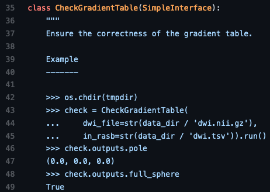
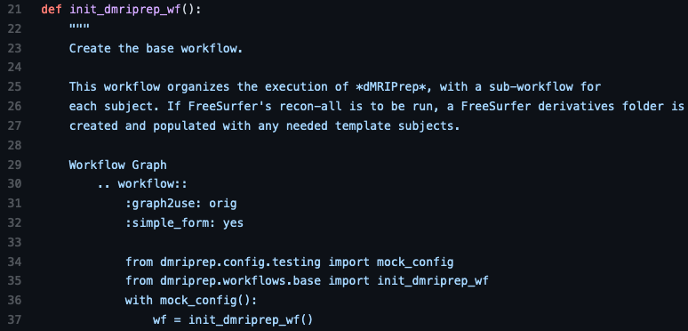
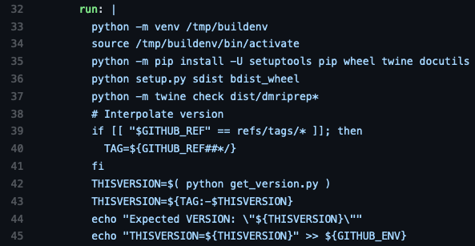

# NeuroImaging PREProcessing toolS (NiPreps)

Pre-processing MRI data is a necessary task before doing any kind of data analysis.

Different kinds of artifacts can occur during a scan due to:

- the subject
  - head motion
  - breathing, heart beating, blood vessels
  - metal items
- scanner hardware limitations
  - distortions due to *B<sub>0</sub>* and *B<sub>1</sub>* inhomogeneities
  - eddy currents
  - signal drift
- image reconstruction
  - Gibbs ringing

These physiological and acquisition artifacts can lower the accuracy, precision, and robustness of our analyses, and confound the interpretation of the results.
Thus, pre-processing is necessary to minimize their influence and to promote more sensitive analyses.

Pre-processing can also help prepare the data for analysis in other ways.
Some examples include:

- image registration between acquisitions (e.g., sessions, runs, modalities, etc.)
- image registration to standard spaces
- identifying spurious sources of signal
- automated segmentation (e.g., brain masking, tissue classification)

## The problem of methodological variability

Generally, researchers create ad-hoc pre-processing workflows for each dataset, building upon a large inventory of available tools.
The complexity of these workflows has snowballed with rapid advances in acquisition parameters and processing steps.

In Botvinik et al., 2020 [^botvinik2020], 70 independent teams were tasked with analyzing the same fMRI dataset and testing 9 hypotheses.
The study demonstrated the huge amount of variability in analytic approaches as *no two teams* chose identical workflows.
One encouraging finding was that 48% of teams chose to pre-process the data using *fMRIPrep* [^esteban2019], a standardized pipeline for fMRI data.

A similar predicament exists in the field of dMRI analysis.
There has been a lot of effort in recent years to compare the influence of various pre-processing steps on tractography and structural connectivity [^oldham2020] [^schilling2019] and harmonize different datasets [^tax2019].

Differences in methods or parameters chosen [^carp2012] [^bowring2019], implementations across software [^dickie2017], and even operating systems or software versions [^gronenschild2012] [^glatard2015] all contribute to variability.

Doing reproducible neuroimaging research is hard.
All of this points to a need for creating standardized pipelines for pre-processing MRI data that will reduce methodological variability and enable comparisons between different datasets and downstream analysis decisions.

## Augmenting the scanner to produce "analysis grade" data

```{image} ../images/sashimi.jpg
:name: sashimi
:width: 200px
:align: right
```

*NiPreps* are a collection of tools that work as an extension of the scanner produce "*analysis-grade*" data.
By *analysis-grade* we mean something like *sushi-grade fish*:
*NiPreps* produce ***minimally preprocessed*** data that nonetheless are **"*safe to consume*"** (meaning, ready for modeling and statistical analysis).
From the reversed perspective, *NiPreps* are designed to be ***agnostic to downstream analysis***.
This means that *NiPreps* are carefully designed not to limit the potential analyses that can be performed on the preprocessed data.
For instance, because spatial smoothing is a processing step tightly linked with the assumptions of your statistical model, *fMRIPrep* does not perform any spatial smoothing step.

Below is a depiction of the projects currently maintained by the *NiPreps community*.
These tools arose out of the need to extend *fMRIPrep* to new imaging modalities and populations.

They can be organized into 3 layers:

- Software infrastructure: deliver low-level interfaces and utilities
- Middleware: contain functions that generalize across the end-user tools
- End-user tools: perform pre-processing or quality control

```{figure} ../images/nipreps-chart.png
:name: nipreps_chart
```

## NiPreps driving principles

*NiPreps* are driven by three main principles, which are summarized below.
These principles distill some design and organizational foundations.

### 1. Robust with very diverse data

*NiPreps* are meant to be robust to different datasets and attempt to provide the best possible results independent of scanner manufacturer, acquisition parameters, or the presence of additional correction scans (such as field maps).
The end-user tools only impose a single constraint on the input dataset - being compliant with BIDS (Brain Imaging Data Structure) [^gorgolewski2016].
BIDS enables consistency in how neuroimaging data is structured and ensures that the necessary metadata is complete.
This minimizes human intervention in running the pipelines as they are able to adapt to the unique features of the input data and make decisions about whether a particular processing step is appropriate or not.

The scope of these tools is strictly limited to pre-processing tasks.
This eases the burden of maintaining these tools but also helps focus on standardizing each processing step and reducing the amount of methodological variability.
*NiPreps* only support BIDS-Derivatives as output.

*NiPreps* also aim to be robust in their codebase.
The pipelines are modular and rely on widely-used tools such as AFNI, ANTs, FreeSurfer, FSL, Nilearn, or DIPY and are extensible via plug-ins.
This modularity in the code allows each step to be thoroughly tested. Some examples of tests performed on different parts of the pipeline are shown below:

```{tabbed} unittest
Checks whether a function or class method behaves as expected.


```

```{tabbed} doctest
Also checks whether code behaves as expected and serves as an example for how to use the code.




```

```{tabbed} integration test
Checks the behaviour of a system (multiple pieces of code).
Can also be used to determine whether the system is behaving suboptimally.


```

```{tabbed} build test
Checks that code or software environment can be compiled and deployed.


```

### 2. Easy to use

*NiPreps* are packaged as a fully-compliant BIDS-Apps [^gorgolewski2017].
All of the software is containerized and the pipelines all share a common command-line interface:

`<pipelines_name> <bids_dir> <output_dir> <participant> [--options]`

Thanks to limiting the input dataset to BIDS, manual parameter input is reduced to a minimum, allowing the pipelines to run in an automated fashion.

### 3. "Glass box" philosophy

*NiPreps* are thoroughly and transparently documented (including the generation of individual subject-level visual reports with a consistent format that serve as scaffolds for understanding the quality of each pre-processing step and any design decisions). Below is an example report:

```{figure} ../images/dwi_reportlet.gif
:name: reportlet
```

*NiPreps* are also community-driven.
The success of these tools has largely been driven by their strong uptake in the neuroimaging community.
This has allowed them to be exercised on diverse datasets and has brought the interest of a variety of domain experts to contribute their knowledge towards improving the tools.
The tools are "open source" and all of the code and ideas are visible on GitHub.

### References

[^botvinik2020]: Botvinik-Nezer, R., Holzmeister, F., Camerer, C.F. et al. Variability in the analysis of a single neuroimaging dataset by many teams. Nature 582, 84–88 (2020). doi: 10.1038/s41586-020-2314-9

[^esteban2019]: Esteban, O., Markiewicz, C.J., Blair, R.W. et al. fMRIPrep: a robust preprocessing pipeline for functional MRI. Nat Methods 16, 111–116 (2019). doi: 10.1038/s41592-018-0235-4

[^oldham2020]: Oldham, S., Arnatkevic̆iūtė, A., Smith, R.W., et al. The efficacy of different preprocessing steps in reducing motion-related confounds in diffusion MRI connectomics. NeuroImage 222 117252 (2020). doi: 10.1016/j.neuroimage.2020.117252

[^schilling2019]: Schilling, K. G., Daducci, A., Maier-Hein, K., Poupon, C., Houde, J. C., Nath, V., Anderson, A. W., Landman, B. A., & Descoteaux, M. (2019). Challenges in diffusion MRI tractography - Lessons learned from international benchmark competitions. Magnetic resonance imaging, 57, 194–209. doi: 10.1016/j.mri.2018.11.014

[^tax2019]: Tax, C. M., Grussu, F., Kaden, E., Ning, L., Rudrapatna, U., John Evans, C., St-Jean, S., Leemans, A., Koppers, S., Merhof, D., Ghosh, A., Tanno, R., Alexander, D. C., Zappalà, S., Charron, C., Kusmia, S., Linden, D. E., Jones, D. K., & Veraart, J. (2019). Cross-scanner and cross-protocol diffusion MRI data harmonisation: A benchmark database and evaluation of algorithms. NeuroImage, 195, 285–299. doi: 10.1016/j.neuroimage.2019.01.077

[^carp2012]: Carp J. On the plurality of (methodological) worlds: estimating the analytic flexibility of FMRI experiments. Front Neurosci. 2012 Oct 11;6:149. doi: 10.3389/fnins.2012.00149

[^bowring2019]: Bowring, A, Maumet, C, Nichols, TE. Exploring the impact of analysis software on task fMRI results. Hum Brain Mapp. 2019; 40: 3362– 3384. doi: 10.1002/hbm.24603

[^dickie2017]: Dickie E, Hodge S, Craddock R, Poline J, Kennedy D (2017) Tools Matter: Comparison of Two Surface Analysis Tools Applied to the ABIDE Dataset. Research Ideas and Outcomes 3: e13726. doi: 10.3897/rio.3.e13726

[^gronenschild2012]: Gronenschild EH, Habets P, Jacobs HI, Mengelers R, Rozendaal N, van Os J, Marcelis M. The effects of FreeSurfer version, workstation type, and Macintosh operating system version on anatomical volume and cortical thickness measurements. PLoS One. 2012;7(6):e38234. doi: 10.1371/journal.pone.0038234

[^glatard2015]: Glatard T, Lewis LB, Ferreira da Silva R, Adalat R, Beck N, Lepage C, Rioux P, Rousseau M-E, Sherif T, Deelman E, Khalili-Mahani N and Evans AC (2015) Reproducibility of neuroimaging analyses across operating systems. Front. Neuroinform. 9:12. doi: 10.3389/fninf.2015.00012

[^gorgolewski2016]: Gorgolewski, K., Auer, T., Calhoun, V. et al. The brain imaging data structure, a format for organizing and describing outputs of neuroimaging experiments. Sci Data 3, 160044 (2016). doi: 10.1038/sdata.2016.44

[^gorgolewski2017]: Gorgolewski KJ, Alfaro-Almagro F, Auer T, Bellec P, Capotă M, Chakravarty MM, Churchill NW, Cohen AL, Craddock RC, Devenyi GA, Eklund A, Esteban O, Flandin G, Ghosh SS, Guntupalli JS, Jenkinson M, Keshavan A, Kiar G, Liem F, Raamana PR, Raffelt D, Steele CJ, Quirion PO, Smith RE, Strother SC, Varoquaux G, Wang Y, Yarkoni T, Poldrack RA. BIDS apps: Improving ease of use, accessibility, and reproducibility of neuroimaging data analysis methods. PLoS Comput Biol. 2017 Mar 9;13(3):e1005209. doi: 10.1371/journal.pcbi.1005209
